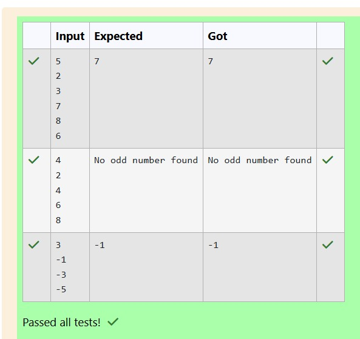

# Ex.No:1(D) ARRAYS

## QUESTION:
Write a Java program to find the maximum odd number in an array

## AIM:
To write a Java program to find the maximum odd number present in a given array.

## ALGORITHM :
1.	Start the program.
2.	Import the necessary package 'java.util'
3.	Start the program and read the number of elements n.
4.	Read n elements and store them in an array.
5.	Initialize maxOdd to the smallest integer and a flag foundOdd as false.
6.	Traverse the array and check if each element is odd (arr[i] % 2 != 0); if true, update maxOdd with the largest odd value.
7.	If an odd number exists, print maxOdd; otherwise print "No odd number found", then stop the program.


## PROGRAM:
 ```java
import java.util.Scanner;

public class MaxOddNumber {
    public static void main(String[] args) {
        Scanner sc = new Scanner(System.in);
        int n = sc.nextInt();
        int[] arr = new int[n];
        for (int i = 0; i < n; i++) {
            arr[i] = sc.nextInt();
        }
        int maxOdd = Integer.MIN_VALUE;
        boolean foundOdd = false;
        for (int i = 0; i < n; i++) {
            if (arr[i] % 2 != 0) {
                foundOdd = true;
                if (arr[i] > maxOdd) {
                    maxOdd = arr[i];
                }
            }
        }
        if (foundOdd) {
            System.out.println(maxOdd);
        } else {
            System.out.println("No odd number found");
        }
        sc.close();
    }
}

```

## SOURCE CODE:


## OUTPUT:



## RESULT:
The program successfully finds and displays the maximum odd number in the array or prints "No odd number found" if none exist.
